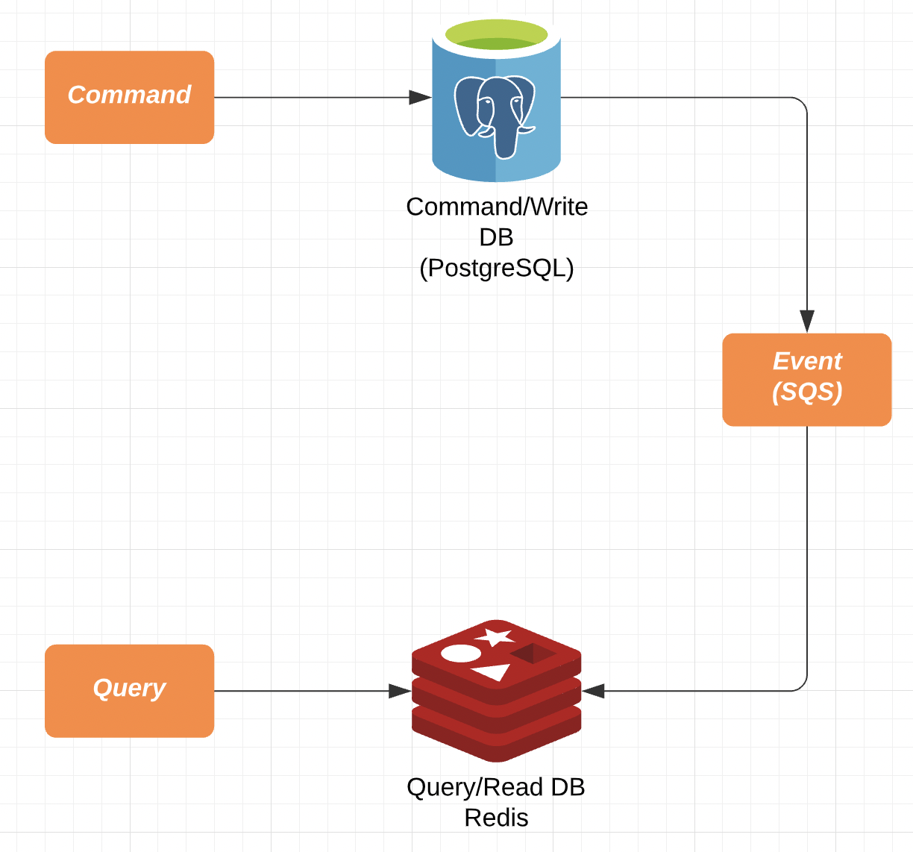

# Spring Boot CQRS Example

Implemented CQRS architecture through spring boot.

For reference, in this example, multi-module is not used. In production, it will be common to configure multimodules. However, it is not applied because it is just an example.

# Architecture overview

- Command used MySQL and query used Redis.
- Changes are synchronized through events via SQS and maintain final consistency.
- The event uses a zero payload form containing only id values, and the consumer uses rest api call to get the latest data. This eliminates concerns about order guarantees.